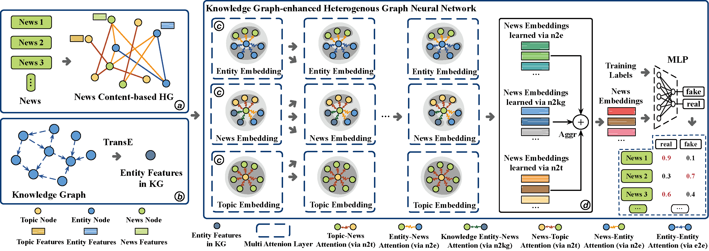

  
   

<h1> Knowledge Graph Enhanced Heterogeneous Graph Neural Network for Fake News Detection </h1>

Open-sourced implementation for Knowledge Enhanced Heterogeneous Graph Neural Network for Fake News Detection - KEHGNN-FD.

<h2> Python Dependencies </h2>

Our proposed KEHGNN-FD framework is implemented in Python 3.7 and major libraries include: 

* [Pytorch](https://pytorch.org/) = 1.11.0+cu102
* [PyG] (https://pytorch-geometric.readthedocs.io/en/latest/) torch-geometric=2.1.0

More dependencies are provided in requirements.txt.

<h2> To Run </h2>

`python src/main.py`

<h2> Experimental Results </h2>

| **Covid-19** | **RNN**             | **BiLSTM**          | **TextCNN**      | **TextGCN** | **AugTextGCN** | **HGAT**            | **CompareNet**      | **KEHGNN-FD**       |
|:----------------------:|:------------------------------:|:------------------------------:|:---------------------------:|:----------------------:|:-------------------------:|:------------------------------:|:------------------------------:|:------------------------------:|
| Accuracy             | 86.10 $\pm$ 0.31             | 87.74 $\pm$ 0.13 | 84.76 $\pm$ 0.09          | 61.32 $\pm$ 2.03     | 61.82 $\pm$ 2.56        | 84.51 $\pm$ 0.05             | 84.49 $\pm$ 0.10             | 90.10 $\pm$ 0.26    |
| Precision            | 85.67 $\pm$ 0.43             | 93.55 $\pm$ 0.11    | 88.17 $\pm$ 0.08          | 50.38 $\pm$ 3.21     | 50.76 $\pm$ 3.53        | 84.06 $\pm$ 0.13             | 84.18 $\pm$ 0.13             | 89.97 $\pm$ 0.46 |
| Recall               | 83.46 $\pm$ 0.36 | 78.33 $\pm$ 0.34             | 77.17 $\pm$ 0.20          | 77.22 $\pm$ 3.88     | 77.58 $\pm$ 3.93        | 81.23 $\pm$ 0.14             | 80.82 $\pm$ 0.19             | 88.36 $\pm$ 1.01    |
| F1-score             | 84.49 $\pm$ 0.32             | 85.21 $\pm$ 0.18 | 82.28 $\pm$ 0.10          | 58.76 $\pm$ 3.18     | 59.17 $\pm$ 3.26        | 82.60 $\pm$ 0.05             | 82.45 $\pm$ 0.12             | 89.16 $\pm$ 0.36    |

| **FakeNewsNet** | **RNN**             | **BiLSTM**          | **TextCNN**      | **TextGCN** | **AugTextGCN** | **HGAT**            | **CompareNet**      | **KEHGNN-FD**       |
|:----------------------:|:------------------------------:|:------------------------------:|:---------------------------:|:----------------------:|:-------------------------:|:------------------------------:|:------------------------------:|:------------------------------:|
| Accuracy             | 59.39 $\pm$ 0.26             | 73.12 $\pm$ 0.22             | 70.49 $\pm$ 0.16          | 73.34 $\pm$ 1.25     | 73.55 $\pm$ 1.63        | 75.51 $\pm$ 0.19             | 76.55 $\pm$ 0.18 | 78.73 $\pm$ 2.12    |
| Precision            | 53.02 $\pm$ 3.81             | 69.00 $\pm$ 0.32 | 66.72 $\pm$ 0.11          | 36.39 $\pm$ 4.46     | 36.71 $\pm$ 4.56        | 68.63 $\pm$ 0.21             | 68.78 $\pm$ 0.22             | 72.53 $\pm$ 2.78    |
| Recall               | 4.67 $\pm$ 0.61              | 64.58 $\pm$ 0.34             | 67.36 $\pm$ 0.27          | 30.64 $\pm$ 3.76     | 31.11 $\pm$ 3.93        | 75.71 $\pm$ 0.63             | 79.01 $\pm$ 0.29 | 80.89 $\pm$ 2.07    |
| F1-score             | 7.87 $\pm$ 0.95              | 66.68 $\pm$ 0.29             | 67.04 $\pm$ 0.14          | 33.23 $\pm$ 4.07     | 33.70 $\pm$ 4.13        | 71.81 $\pm$ 0.26             | 73.50 $\pm$ 0.18 | 76.46 $\pm$ 2.08    |

| **PAN2020** | **RNN**             | **BiLSTM**          | **TextCNN**      | **TextGCN** | **AugTextGCN** | **HGAT**            | **CompareNet**      | **KEHGNN-FD**       |
|:----------------------:|:------------------------------:|:------------------------------:|:---------------------------:|:----------------------:|:-------------------------:|:------------------------------:|:------------------------------:|:------------------------------:|
| Accuracy             | 52.47 $\pm$ 0.65             | 52.74 $\pm$ 0.39             | 50.82 $\pm$ 0.53          | 55.13 $\pm$ 1.31     | 55.47 $\pm$ 1.75        | 63.70 $\pm$ 0.73 | 63.56 $\pm$ 0.51             | 71.37 $\pm$ 1.51    |
| Precision            | 52.70 $\pm$ 0.52             | 55.41 $\pm$ 0.63             | 54.32 $\pm$ 0.64          | 31.77 $\pm$ 3.90     | 32.21 $\pm$ 4.32        | 60.81 $\pm$ 0.90             | 63.61 $\pm$ 0.70 | 66.73 $\pm$ 1.87    |
| Recall               | 76.86 $\pm$ 2.85             | 80.36 $\pm$ 2.86 | 76.80 $\pm$ 3.51          | 26.25 $\pm$ 3.24     | 27.10 $\pm$ 3.70        | 72.35 $\pm$ 0.78             | 76.31 $\pm$ 1.30             | 80.57 $\pm$ 1.81    |
| F1-score             | 59.82 $\pm$ 1.59             | 61.41 $\pm$ 1.31             | 57.74 $\pm$ 1.84          | 28.62 $\pm$ 3.51     | 29.15 $\pm$ 3.57        | 65.82 $\pm$ 0.77             | 68.28 $\pm$ 0.48 | 72.97 $\pm$ 1.12    |

| **Liar** | **RNN**             | **BiLSTM**          | **TextCNN**      | **TextGCN** | **AugTextGCN** | **HGAT**            | **CompareNet**      | **KEHGNN-FD**       |
|:----------------------:|:------------------------------:|:------------------------------:|:---------------------------:|:----------------------:|:-------------------------:|:------------------------------:|:------------------------------:|:------------------------------:|
| Accuracy             | 54.59 $\pm$ 0.11             | 60.61 $\pm$ 0.15    | 58.77 $\pm$ 2.20          | 54.97 $\pm$ 6.83     | 55.25 $\pm$ 6.86        | 56.10 $\pm$ 0.18             | 54.95 $\pm$ 0.11             | 59.67 $\pm$ 0.94 |
| Precision            | 36.31 $\pm$ 2.09             | 59.47 $\pm$ 0.39 | 65.87 $\pm$ 3.05 | 14.7 $\pm$ 24.33     | 14.9 $\pm$ 22.54        | 51.36 $\pm$ 0.24             | 49.81 $\pm$ 0.17             | 53.73 $\pm$ 1.20             |
| Recall               | 1.24 $\pm$ 0.15              | 45.33 $\pm$ 0.58             | 21.20 $\pm$ 5.41          | 21.19 $\pm$ 41.7     | 21.46 $\pm$ 40.5        | 50.10 $\pm$ 0.25             | 50.33 $\pm$ 0.19 | 56.63 $\pm$ 2.50    |
| F1-score             | 2.34 $\pm$ 0.27              | 51.12 $\pm$ 0.31 | 51.06 $\pm$ 3.49          | 13.84 $\pm$ 24.7     | 14.33 $\pm$ 25.6        | 50.71 $\pm$ 0.23             | 50.03 $\pm$ 0.12             | 55.09 $\pm$ 0.91    |

